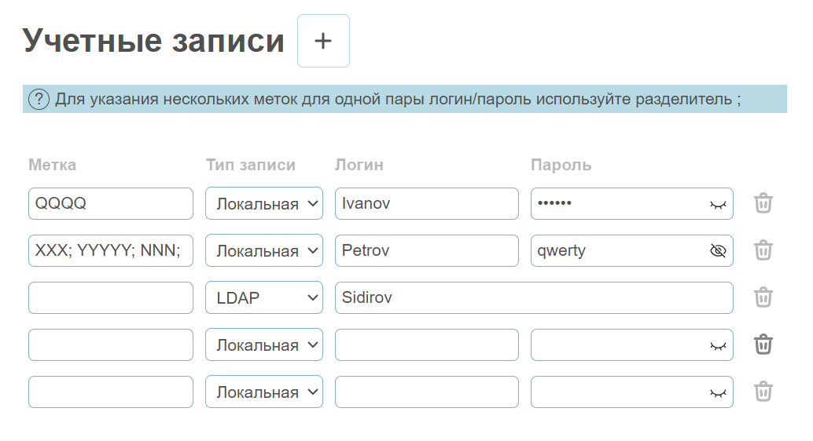

# Форма управления учетными записями

Интерфейс управления учетными записями позволяет создавать, редактировать и удалять локальные и LDAP-учетные записи. Поля валидируются при вводе, метки сохраняются как массив объектов, а все данные автоматически сохраняются в Pinia и доступны после перезагрузки страницы. Пользователь может добавлять новые записи, указывать логин, пароль и тип записи, а некорректные поля подсвечиваются.



## Начало работы

1. Установите `node.js` Поддерживаемая версия сборки `20+`
2. Установите зависимости с помощью

```shell
npm ci
```

3. Запустите проект с помощью

```shell
npm run dev
```
